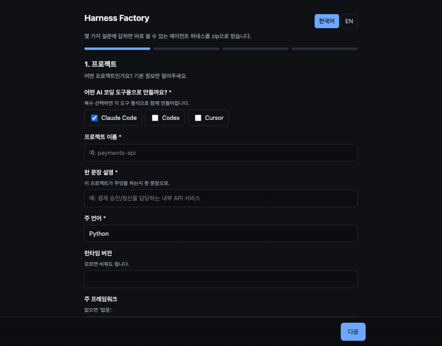

#Harness Factory

**Answer a few questions → download a production-ready agent harness for Claude Code, Codex, or Cursor.**



Harness engineering is the highest-ROI lever for coding agents — but writing a good `CLAUDE.md`, wiring skills, picking MCP servers, and setting safe guardrails by hand is tedious and easy to get wrong. Harness Factory turns that setup into a 4-step survey and hands you a drop-in bundle.

[](https://github.com/Kimyongari/harness-factory/actions/workflows/ci.yml)
[](LICENSE)
[](https://www.python.org/)
[](#-supported-tools)

> Available in **English and Korean** — toggle in the top-right of the wizard. 한국어 안내는 아래 [한국어](#-한국어) 섹션을 보세요.

---

## Why

> "Check the harness before changing the model — it's usually the best ROI." — the lesson teams keep relearning in 2026.

A model is only as good as the environment around it. Harness Factory bakes in the hard-won best practices so you don't have to:

- **Context hygiene** — a thin router file instead of a 1,000-line encyclopedia (avoids "everything important = nothing followed").
- **Prohibitions paired with alternatives** — every "don't" comes with a "do this instead".
- **Mechanical enforcement** — rules that matter ship with a checker script, not just prose.
- **Selective tools** — pick only the MCP servers you need (connecting all of them rots the context window).
- **Secrets stay safe** — tokens go to `.env` only; config files reference `${VARS}`, never inline.

## What you get

A 4-step survey produces a harness covering **4 domains** — development, documentation, web research, and GitHub workflow — adapted to the tool you choose.

```
your-project/
├── CLAUDE.md / AGENTS.md / .cursor/rules/   # tool-specific instructions
├── .claude/skills/  ·  .skills/  ·  .cursor/rules/   # the 4 domain rule-sets
├── .docs/        # hierarchical context (design, specs, plans, references)
├── .scripts/     # verify.sh + mechanical boundary checker
├── .mcp.json / .codex/config.toml / .cursor/mcp.json   # selected MCP servers
└── .env(.example) + .gitignore   # your tokens, never committed
```

## 🚀 Quickstart

```bash
git clone https://github.com/Kimyongari/harness-factory.git
cd harness-factory

python -m venv .venv && source .venv/bin/activate
pip install -e .

harness-factory          # starts the web app at http://127.0.0.1:8000
```

Open the browser, pick **English or Korean** (top-right toggle), walk through the 4 steps, and download your `.zip`. Unzip it into your project root and you're done.

### 🐳 Or run with Docker

```bash
docker build -t harness-factory .
docker run --rm -p 8000:8000 harness-factory
# open http://127.0.0.1:8000
```

### CLI

Generate from a JSON answer file (`--lang ko|en`):

```bash
python -m harness_maker.engine --lang en --answers tests/sample_answers.json --out harness.zip
```

## 🧩 Supported tools

| | Claude Code | Codex | Cursor |
|---|---|---|---|
| Instructions | `CLAUDE.md` | `AGENTS.md` | `.cursor/rules/00-overview.mdc` |
| Skills / Rules | `.claude/skills/*/SKILL.md` | `.skills/*` (referenced) | `.cursor/rules/*.mdc` |
| MCP config | `.mcp.json` | `.codex/config.toml` | `.cursor/mcp.json` |
| Secrets | `.env` (`${VAR}`) | `.env` (`env_vars`) | `.env` (`${VAR}`) |

Pick one or several — choosing multiple nests each under its own folder (`claude-code/`, `codex/`, `cursor/`).

## 📋 The survey (4 steps)

1. **Project** — name, language, framework, package manager (dropdowns; type your own if it's not listed).
2. **Dev conventions** *(skippable → safe defaults)* — commands, never-touch paths, layer boundaries, commit style.
3. **Documentation** *(skippable → defaults)* — language, tone, format.
4. **Integrations & auth** *(skippable)* — pick MCP servers, enter only the tokens they need.

Only **5 fields are required**; everything else has a sensible default, so juniors can ship a good harness in under a minute.

## 🔌 MCP catalog

Curated for everyday development. Pick what you need:

`GitHub` · `Filesystem` · `Brave Search` · `Fetch` · `Notion` · `Slack` · `Sentry` · `PostgreSQL` · `Sequential Thinking` · `Playwright`

Token-based servers reveal their auth fields only when selected. Your tokens are written to `.env` (git-ignored) and referenced from config — never hard-coded.

## 🛠 How it works

```
survey.yaml (schema) ─┐
mcp_catalog.yaml ─────┤→ engine: validate → fill defaults → substitute {{FILL}} ─→ per-tool adapter ─→ .zip
template/ (neutral) ──┘
```

- `template/` is the **framework-neutral** harness, full of `{{FILL:key}}` placeholders.
- `survey.yaml` is the single source of truth for what users fill in.
- Adapters translate the neutral bundle into each tool's native layout.

## 📂 Project structure

```
harness-factory/
├── survey.ko.yaml / survey.en.yaml   # 4-step survey schema (per language)
├── mcp_catalog.yaml         # curated MCP servers (bilingual descriptions)
├── template/ko/  ·  template/en/     # the neutral harness (filled + zipped)
├── src/harness_maker/
│   ├── engine.py            # validate · default · substitute · adapt · zip
│   ├── app.py               # FastAPI: /api/survey, /api/generate
│   └── static/index.html    # 4-step wizard UI (KO/EN toggle)
├── Dockerfile
└── tests/                   # pytest suite
```

## 🧪 Development

```bash
pip install -e ".[dev]"
pre-commit install                 # lint/format hooks on commit
pre-commit install --hook-type pre-push   # run tests before push
pytest -q
```

Code quality is enforced by **pre-commit hooks** (ruff lint + format, plus YAML/JSON/TOML
checks, large-file/merge-conflict/private-key guards) and a **GitHub Actions CI** that runs
`ruff check`, `ruff format --check`, and `pytest` on every push and PR.

## 🗺 Roadmap

- [x] English & Korean survey UI + generated docs (i18n)
- [x] Docker packaging
- [ ] More targets (Gemini CLI, Windsurf, Aider)
- [ ] Pre-download bundle preview
- [ ] Branching survey (questions adapt to earlier answers)
- [ ] Shareable harness presets

## 🤝 Contributing

Issues and PRs welcome — new MCP servers, new target adapters, and better default rules are especially appreciated. Adding a target is just one more adapter in `engine.py`.

## 📄 License

MIT — see [LICENSE](LICENSE).

---

## 🇰🇷 한국어

**설문 몇 개에 답하면 Claude Code · Codex · Cursor용 에이전트 하네스를 zip으로 받습니다.**

좋은 하네스(=에이전트를 감싸는 지침·스킬·MCP·가드레일)는 모델 교체보다 ROI가 높지만, 직접 만들기는 번거롭습니다. Harness Factory는 그 셋업을 4단계 설문으로 바꿔 바로 쓸 수 있는 번들을 만들어 줍니다.

### 빠른 시작
```bash
git clone https://github.com/Kimyongari/harness-factory.git
cd harness-factory
python -m venv .venv && source .venv/bin/activate
pip install -e .
harness-factory        # http://127.0.0.1:8000
```
또는 Docker로:
```bash
docker build -t harness-factory . && docker run --rm -p 8000:8000 harness-factory
```
브라우저에서 언어(한국어/EN)를 고르고 4단계를 진행한 뒤 zip을 받아, 프로젝트 루트에 풀면 끝입니다.

### 특징
- **4개 도메인** 규칙: 개발 · 문서작업 · 웹검색 · 깃허브
- **필수 항목 5개**, 나머지는 기본값 — 주니어도 1분 안에 좋은 하네스 생성
- **도구별 자동 변환**: Claude Code / Codex / Cursor (복수 선택 가능)
- **토큰 안전**: `.env`에만 저장, 설정 파일엔 `${VAR}` 참조, `.gitignore` 자동 포함
