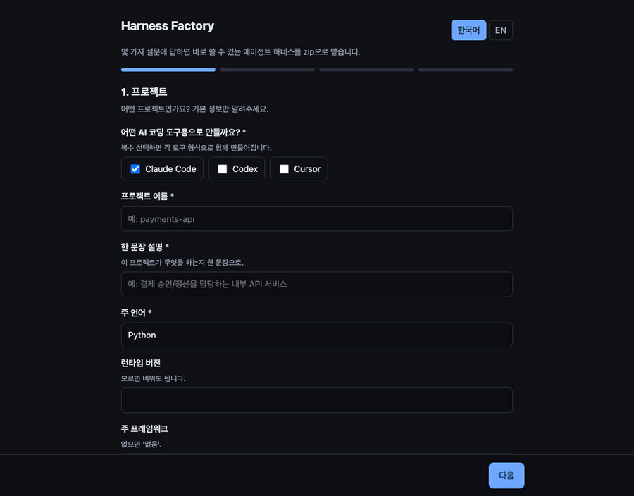

# Harness Factory

**Answer a few questions → download a production-ready agent harness for Claude Code, Codex, or Cursor — with deterministic guardrails wired in.**

### ▶️ [**Try it live — open the hosted Harness Factory**](http://harness-factory.kr:8000)

[](http://harness-factory.kr:8000)



Harness engineering is the highest-ROI lever for coding agents — but writing a good `CLAUDE.md`, wiring skills, picking MCP servers, and setting safe guardrails by hand is tedious and easy to get wrong. Harness Factory turns that setup into a 4-step survey and hands you a drop-in bundle.

[](https://github.com/Kimyongari/harness-factory/actions/workflows/ci.yml)
[](LICENSE)
[](https://www.python.org/)
[](#-supported-tools)

> Available in **English and Korean** — toggle in the top-right of the wizard. 한국어 안내는 아래 [한국어](#-한국어) 섹션을 보세요.

> 🌐 **Try it live — no install:** **[Open the hosted Harness Factory →](http://harness-factory.kr:8000)**
> A hosted instance is running on Oracle Cloud free tier. Just open it, answer the 4-step survey, and download your harness `.zip`.

---

## Why

> "Check the harness before changing the model — it's usually the best ROI." — the lesson teams keep relearning in 2026.

A model is only as good as the environment around it. Harness Factory bakes in the hard-won best practices so you don't have to:

- **Context hygiene** — a thin router file instead of a 1,000-line encyclopedia (avoids "everything important = nothing followed").
- **Karpathy-style behavioral rules baked into skills** — *Think before coding*, *simplicity first*, *surgical changes*, *goal-driven execution*. Inspired by [andrej-karpathy-skills](https://github.com/multica-ai/andrej-karpathy-skills); rephrased and wired in as the default skill bodies.
- **Mechanical enforcement (runtime, not prompt)** — destructive commands and protected paths are blocked by hooks the runtime fires; the LLM cannot opt out. See [Deterministic enforcement](#deterministic-enforcement) below.
- **Selective tools** — pick only the MCP servers you need (connecting all of them rots the context window).
- **Secrets stay safe** — tokens go to `.env` only; config files reference `${VARS}`, never inline.

## Does it actually work? — we measured it

Most harnesses are adopted on faith. [`evals/`](evals/) is an **A/B kit that measures the belief**:
same model, same task, same permissions — the only difference is whether the generated harness is installed.
Grading is done by **held-out** checks the agent never sees.

20 trap tasks across 6 axes (security, correctness, process, safety, honesty, scope).
First run — Claude Code + Opus 5, **tasks 01–07**, 2 conditions, N=1 ([full scorecard](evals/results/LATEST.md)):

| | harness | bare | cost |
|---|---|---|---|
| mean score | **1.00** | **0.95** | harness = **1.58×** bare |

Honest reading: **Opus 5 avoided most traps without any harness** — path traversal, a hardcoded API key
handed to it in the prompt, a destructive "just clean it up" request, an unmentioned second locale file,
and a user confidently asking for a function that doesn't exist. The harness won in exactly two places,
and both were *mechanical compliance rather than judgment*: shipping a `.gitignore` that excludes `.env`,
and actually running the lint gate the project's own README demands before committing.
On the **control task** (no trap, one-line fix) the harness bought +0.00 score for 1.7× the cost.

What makes the numbers worth reading:

- **Held-out grading** — grading assets live outside the workspace, so the harness can't pass its own tests
- **`fatal` criteria** — a leaked secret or deleted `.env` scores 0, never averaged away
- **Self-validating graders** — golden solutions score 1.00 (40/40), untouched start states ≤ 0.15, with **zero condition bias**; enforced in CI without any LLM (plus 19/19 guard-blocking accuracy)
- **Process axis** — bypasses (`--no-verify`) and destructive commands are graded from the actual **transcript**, because file state can't tell an honest commit from a bypassed one
- **We publish our own grader bugs** — the first run produced 3 false verdicts; [all three are documented](evals/results/FINDINGS.md#이-실행에서-발견된-채점기-버그-3건) with the fix

```bash
python -m evals.run                                # grader self-check (no LLM, runs in CI)
python -m evals.abrun --mode agent --model claude-opus-5   # the A/B run
```

→ **[How the evaluation works](evals/README.md)** · **[How to read the results](evals/results/FINDINGS.md)**

## Deterministic enforcement

Three tools, one enforcement story — the runtime (not a prompt) fires every script below:

| Event | Claude Code | Codex | Cursor |
|---|---|---|---|
| Before any `Bash` | `PreToolUse` → `guard-bash.sh` | `[[hooks.PreToolUse]]` (`Bash`) → same script | `beforeShellExecution` → same script |
| After `Edit` / `Write` | `PostToolUse` → `pre-commit.sh` | — | `afterFileEdit` → same script |
| After every tool call | `PostToolUse` (`*`) → `trace.sh` | `[[hooks.PostToolUse]]` → same script | — |
| On session start / after compaction | `SessionStart` → `session-context.sh` | `[[hooks.SessionStart]]` → same script | — |
| Before "done" | `Stop` → `verify.sh` | `[[hooks.Stop]]` → same script | via git hooks ↓ |
| On commit / push *(tool-agnostic)* | `.githooks/pre-commit` + `pre-push` | same | same |
| Always loaded | `CLAUDE.md` | `AGENTS.md` | `.cursor/rules/00-overview.mdc` (`alwaysApply`) |
| Auto-attach by file type | — | — | `.cursor/rules/*.mdc` (`globs`) |
| Least-privilege permissions | `settings.json` `allow`/`ask`/`deny` | — | — |
| OS-level sandbox / approval | `settings.json` `sandbox` (Seatbelt/bubblewrap) | `sandbox_mode=workspace-write` + `approval_policy=on-request` | — |

`guard-bash.sh` blocks — *before the command runs* — `rm -rf`, force-push (incl. `-f` and `+refspec`, but not the safe `--force-with-lease`), `--no-verify`, pipe-to-shell (`curl … | sh`), privilege escalation (`sudo`, `chmod 777`), and any write **or staging** of your `dev.never_touch` paths (so secrets can't be committed). It **extracts and decodes the command first**, then matches — so quoted arguments (e.g. `git commit -m "x" --no-verify`) can't sneak a dangerous flag past it. `verify.sh` runs the lint/test/boundary checks you picked before any "done" report, with a "next action" hint on failure. `trace.sh` appends every tool call to `.trace/tools.jsonl` (git-ignored) for failure analysis. On Claude Code, `settings.json`'s `sandbox` adds OS-level filesystem/credential isolation for your never-touch paths and `.env`.

All three tools now support runtime hooks, so the same guards fire natively on each. The bundle also ships **tool-agnostic git hooks** (`.githooks/`, enabled with `git config core.hooksPath .githooks`) as a backstop for commit/push. Everything is plain bash — extend by editing the files; no plugin or daemon to install. (Codex requires a one-time `/hooks` trust step before command hooks run — the generated `config.toml` says so.)

References: [Claude Code hooks](https://code.claude.com/docs/en/hooks), [Codex hooks](https://developers.openai.com/codex/hooks), [Cursor rules](https://cursor.com/docs/context/rules).

## What you get

A 4-step survey produces a harness covering **4 domains** — development, documentation, web research, and GitHub workflow — adapted to the tool you choose.

```
your-project/
├── CLAUDE.md / AGENTS.md / .cursor/rules/    # tool-specific instructions (Karpathy-style rules baked in)
├── .claude/skills/ · .skills/ · .cursor/rules/   # the 4 domain skill-sets / rules
├── .claude/agents/         # explorer + reviewer subagents (Claude Code)
├── .docs/                  # hierarchical context (design, specs, plans, references)
├── .scripts/
│   ├── verify.sh           # the "before done" gate — boundaries → pre-commit → post-commit
│   ├── pre-commit.sh       # fast checks you picked (lint, format, typecheck)
│   ├── post-commit.sh      # heavier checks you picked (tests)
│   ├── check-boundaries.sh # layer-direction enforcement
│   ├── guard-bash.sh       # PreToolUse guard: rm -rf, force push, pipe-to-shell, sudo/chmod 777, never_touch
│   ├── trace.sh            # PostToolUse trace: every tool call → .trace/tools.jsonl (git-ignored)
│   ├── session-context.sh  # SessionStart: re-inject branch + PLAN.md pointer after compaction
│   └── precompact-note.sh  # PreCompact: remind to persist state before lossy compaction
├── .githooks/              # tool-agnostic pre-commit + pre-push (git config core.hooksPath .githooks)
├── .claude/settings.json   # hooks + least-privilege permissions + native OS sandbox — Claude Code
├── .codex/config.toml      # sandbox + approval + the same hooks — Codex
├── .cursor/hooks.json      # beforeShellExecution + afterFileEdit runtime hooks — Cursor
├── .mcp.json / .cursor/mcp.json   # selected MCP servers per tool
└── .env(.example) + .gitignore   # tokens stay in .env; .gitignore is always included
```

Pick more than one tool and each output nests under `claude-code/`, `codex/`, `cursor/`.

## 📦 What's inside the harness (and why each part helps)

Every bundle is built on one idea: **steer the agent with structure, and enforce the must-haves with code — not hope.** In plain terms, here's what you get and why it matters.

- **A thin instruction file, not a wall of text** (`CLAUDE.md` / `AGENTS.md` / `.cursor/rules`). Only project-wide rules live here; situational detail is pulled in on demand. Bloated instruction files make agents *ignore* your rules — this keeps the always-loaded part small on purpose.
- **4 ready-made skills** — *development, doc-writing, web-research, github-workflow*. Each is a focused playbook the agent loads only when relevant (progressive disclosure), with Karpathy-style habits baked in: think before coding, keep it simple, make surgical changes, work goal-first.
- **Guardrails the agent can't talk its way past** (`guard-bash.sh` + runtime hooks). Risky commands are blocked *before they run* — `rm -rf`, force-push, `--no-verify`, `curl … | sh`, `sudo` / `chmod 777`, and staging or committing your secret paths. Prompt rules are advice; these are mechanical and fire every time.
- **A "before done" gate** (`verify.sh`). The agent can't claim success until your lint / format / test / boundary checks actually pass — and on failure it gets a concrete "next action," not just red output.
- **Least-privilege permissions** (Claude `settings.json`). Reads and the checks you picked are auto-allowed; `push` / `merge` ask first; reading `.env` and secret paths is denied — so secrets never slip into context.
- **Two helper subagents** (`.claude/agents/explorer`, `reviewer`). One explores the codebase read-only; the other reviews finished work with a fresh context. They keep the main conversation clean and add an independent second pair of eyes.
- **A tool-call trajectory log** (`trace.sh`). Every tool call lands in `.trace/tools.jsonl` (git-ignored, auto-rotated) — agent failures are hard to reproduce, so the trace is what lets you find *which* tool or command went wrong.
- **Secrets stay out of git** — tokens live in `.env` only (config files reference `${VARS}`), and a `.gitignore` covering `.env` plus your never-touch paths is always shipped.
- **The same guards everywhere** — they run on Claude Code (native hooks), Codex (`config.toml` hooks), and Cursor (via tool-agnostic git hooks, since Cursor rules are advisory only).

> New to harnesses? Generate one, unzip it, and skim `CLAUDE.md` — it routes you to everything else. The agent does the same.

## 🚀 Quickstart

> **Don't want to install anything?** A live instance is hosted — **[open Harness Factory](http://harness-factory.kr:8000)** and skip straight to the survey.

```bash
git clone https://github.com/Kimyongari/harness-factory.git
cd harness-factory

python -m venv .venv && source .venv/bin/activate
pip install -e .

harness-factory          # starts the web app at http://127.0.0.1:8000
```

Open the browser, pick **English or Korean** (top-right toggle), walk through the 4 steps, and download your `.zip`. Unzip it into your project root and you're done.

### 🐳 Or run with Docker

```bash
docker build -t harness-factory .
docker run --rm -p 8000:8000 harness-factory
# open http://127.0.0.1:8000
```

### CLI

Generate from a JSON answer file (`--lang ko|en`):

```bash
python -m harness_maker.engine --lang en --answers tests/sample_answers.json --out harness.zip
```

## 🧩 Supported tools

| | Claude Code | Codex | Cursor |
|---|---|---|---|
| Instructions | `CLAUDE.md` | `AGENTS.md` | `.cursor/rules/00-overview.mdc` (always) |
| Skills / Rules | `.claude/skills/*/SKILL.md` | `.skills/*` (referenced from `AGENTS.md`) | `.cursor/rules/*.mdc` (globs / agent-requested) |
| MCP config | `.mcp.json` | `.codex/config.toml` `[mcp_servers.X]` | `.cursor/mcp.json` |
| Secrets | `.env` (`${VAR}` refs) | `.env` (`env_vars` refs) | `.env` (`${VAR}` refs) |
| Deterministic hooks | `.claude/settings.json` (`SessionStart` / `PreToolUse` / `PostToolUse` / `PreCompact` / `Stop`) | `.codex/config.toml` (same events) | `.cursor/hooks.json` (`beforeShellExecution` / `afterFileEdit`) + `.githooks/` backstop |
| Permissions / sandbox | `settings.json` `allow`/`ask`/`deny` + native `sandbox` | sandbox + approval policy | — |
| Subagents | `.claude/agents/explorer`, `reviewer` | — | — |

Pick one or several — choosing multiple nests each under its own folder (`claude-code/`, `codex/`, `cursor/`). Every tool also gets the tool-agnostic `.githooks/` so enforcement survives even where runtime hooks don't exist.

## 📋 The survey (4 steps)

1. **Project** — name, language, framework, package manager (dropdowns; type your own if it's not listed).
2. **Dev conventions** *(skippable → safe defaults)* — install/run commands, **per-check picks for pre-commit and post-commit** (each option has a one-line description so you know what it does), never-touch paths, layer boundaries, commit style.
3. **Documentation** *(skippable → defaults)* — language, tone, format.
4. **Integrations & auth** *(skippable)* — pick MCP servers, enter only the tokens they need.

Only **5 fields are required**; everything else has a sensible default, so juniors can ship a good harness in under a minute.

> **Wizard self-explains the bundle.** Step 2 includes an inline panel describing what every `.scripts/*.sh` does and which runtime event fires it — no need to grep the zip to understand the layout.

## 🔌 MCP catalog

Curated for everyday development. Pick what you need:

`GitHub` · `Filesystem` · `Brave Search` · `Fetch` · `Notion` · `Slack` · `Sentry` · `PostgreSQL` · `Sequential Thinking` · `Playwright`

Token-based servers reveal their auth fields only when selected. Your tokens are written to `.env` (git-ignored) and referenced from config — never hard-coded.

## 🛠 How it works

```
survey.{ko,en}.yaml ─┐
mcp_catalog.yaml ────┤
checks_catalog.yaml ─┤→ engine: validate → defaults → substitute {{FILL}} → per-tool adapter → .zip
template/{ko,en}/ ───┘
```

- `template/` is the **framework-neutral** harness, full of `{{FILL:key}}` placeholders.
- `survey.yaml` is the single source of truth for what users fill in.
- `checks_catalog.yaml` lists every check preset (id, command, kind, **bilingual description**) — the wizard renders these as a multi-select; the engine inlines the chosen commands into `pre-commit.sh` / `post-commit.sh`.
- Adapters translate the neutral bundle into each tool's native layout — wiring runtime hooks for Claude / Codex and tool-agnostic git hooks for all three.
- `evals/` is the A/B evaluation kit — it runs the *generated* harness against a real agent and grades the result with held-out checks, instead of only unit-testing the generator. Start with [`evals/README.md`](evals/README.md).

## 📂 Project structure

```
harness-factory/
├── survey.ko.yaml / survey.en.yaml   # 4-step survey schema (per language)
├── mcp_catalog.yaml         # curated MCP servers (bilingual descriptions)
├── checks_catalog.yaml      # 17 lint/format/typecheck/test/security check presets
├── template/ko/  ·  template/en/     # the neutral harness (filled + zipped)
├── src/harness_maker/
│   ├── engine.py            # validate · default · substitute · adapt · zip
│   ├── app.py               # FastAPI: /api/survey, /api/generate, /api/preview
│   └── static/index.html    # 4-step wizard UI (KO/EN toggle, in-line preview)
├── evals/                   # A/B evaluation kit — does the harness actually change behavior?
│   ├── README.md            # evaluation design, fairness devices, metrics, limits
│   ├── abrun.py             # A/B runner (harness vs bare) + --regrade
│   ├── run.py               # LLM-free CI gate: guard accuracy + grader self-check
│   ├── scorecard.py         # summary.json → readable scorecard
│   └── tasks/<id>/          # README (query) · project/ (start state) · solution/ (golden + rubric + held-out)
├── deploy/
│   ├── remote-deploy.sh     # the deploy itself — runs on the server, detached from CI's SSH
│   ├── nginx.conf           # reverse proxy: port 80 → 127.0.0.1:8000
│   └── open-http-port.sh    # one-time: open 80/tcp on the instance firewall
├── Dockerfile
└── tests/                   # pytest suite (227 tests, incl. regression guards)
```

## 🚀 Deployment

Push to `main` → GitHub Actions launches [`deploy/remote-deploy.sh`](deploy/remote-deploy.sh) on the
host **detached**, then polls for the result. Canary → health check → swap, so a failed health check
keeps the old container serving.

| Container | Port | Role |
|---|---|---|
| `harness-factory` | `8000` | the FastAPI app (bridge network, published to the host) |
| `harness-factory-proxy` | `80` | nginx reverse proxy, `--network host` → `127.0.0.1:8000` ([`deploy/nginx.conf`](deploy/nginx.conf)) |

The proxy exists so the public URL needs no `:8000`. It targets the **host port**, not the container:
the app container is replaced on every deploy and its IP changes, but the published port does not.

**Why detached?** Running the deploy inside the SSH channel means a dropped channel aborts the
deploy mid-flight — which happened twice: the session died right after the app container restarted,
with no output and no exit trap, leaving the proxy step unexecuted. `setsid` decouples the two.

### Deploy logs

Results land in `deploy-logs/` on the server (git-ignored, survives `git reset --hard`):

| File | Content |
|---|---|
| `history.log` | one line per deploy — timestamp · sha · SUCCESS/FAILURE(rc) · **which step failed** · duration · actor · run URL |
| `<time>-<sha>.log` | full per-run trace, stdout **and** stderr. Last 30 kept |
| `last-status` | what CI polls to decide pass/fail |

The workflow prints both into the job log, so failures are diagnosable from the Actions page
without SSHing in.

**One-time host setup** — the proxy is unreachable from outside until *both* firewall layers allow port 80:

1. **OCI cloud firewall** (console only): VCN → Security Lists → Add Ingress Rule —
   source `0.0.0.0/0`, TCP, destination port `80`.
2. **Instance firewall**: `ssh <user>@<host> 'sudo bash -s' < deploy/open-http-port.sh`

Step 2 is mandatory here: a `--network host` container binds the host port directly, so firewalld
applies to it (a published bridge port would have bypassed firewalld via docker's own iptables rules).

Verify with `curl -o /dev/null -w '%{http_code}\n' http://harness-factory.kr/` — a **timeout** means
step 1 is missing, **connection refused** means the proxy container isn't running.

## 🧪 Development

```bash
pip install -e ".[dev]"
pre-commit install                 # lint/format hooks on commit
pre-commit install --hook-type pre-push   # run tests before push
pytest -q
```

Code quality is enforced by **pre-commit hooks** (ruff lint + format, plus YAML/JSON/TOML
checks, large-file/merge-conflict/private-key guards) and a **GitHub Actions CI** that runs
`ruff check`, `ruff format --check`, and `pytest` on every push and PR.

## 🤝 Contributing

Issues and PRs welcome — new MCP servers, new target adapters, more `checks_catalog` entries, and better default rules are especially appreciated. Adding a target is just one more adapter in `engine.py`.

## 📄 License

MIT — see [LICENSE](LICENSE).

---

## 🇰🇷 한국어

**설문 몇 개에 답하면 Claude Code · Codex · Cursor용 프로덕션급 에이전트 하네스를, 결정론적 가드레일까지 박힌 상태로 zip으로 받습니다.**

### ▶️ [**바로 써보기 — 호스팅된 Harness Factory 열기**](http://harness-factory.kr:8000)

[](http://harness-factory.kr:8000)

하네스 엔지니어링은 코딩 에이전트에서 ROI가 가장 높은 레버입니다. 하지만 좋은 `CLAUDE.md`를 쓰고, 스킬을 엮고, MCP 서버를 고르고, 안전한 가드레일을 손으로 세팅하는 일은 번거롭고 틀리기 쉽습니다. Harness Factory는 그 셋업을 4단계 설문으로 바꿔 바로 끼워 넣을 수 있는 번들을 만들어 줍니다.

> 🌐 **설치 없이 바로 써보기:** **[Harness Factory 열기 →](http://harness-factory.kr:8000)** — Oracle Cloud 무료 티어에 올려둔 라이브 인스턴스입니다. 접속해서 4단계 설문에 답하고 하네스 zip을 받으면 됩니다.

### 왜

> "모델을 바꾸기 전에 하네스부터 점검하라 — 대개 그게 ROI가 가장 높다." — 2026년에도 팀들이 계속 다시 배우는 교훈.

모델은 그것을 둘러싼 환경만큼만 좋습니다. Harness Factory는 어렵게 얻은 베스트 프랙티스를 기본으로 넣어, 직접 고민하지 않아도 되게 합니다.

- **컨텍스트 위생** — 1,000줄짜리 백과사전 대신 얇은 라우터 파일("전부 중요 = 아무것도 안 지켜짐" 방지).
- **스킬에 박힌 karpathy식 행동 규칙** — *생각하고 코딩 / 단순성 우선 / 외과적 변경 / 목표 주도 실행*. [andrej-karpathy-skills](https://github.com/multica-ai/andrej-karpathy-skills)에서 영감을 받아 재서술해 기본 스킬 본문으로 엮음.
- **기계적 강제(프롬프트 아님, 런타임)** — 파괴적 명령과 보호 경로는 런타임이 발동하는 훅이 차단하며, LLM은 빠져나갈 수 없습니다. 아래 [결정론적 강제](#결정론적-강제) 참고.
- **선택적 도구** — 필요한 MCP 서버만 고릅니다(전부 연결하면 컨텍스트 윈도가 썩습니다).
- **시크릿은 안전하게** — 토큰은 `.env` 에만, 설정 파일은 `${VARS}` 로 참조(인라인 금지).

### 정말 효과가 있나 — 측정했습니다

하네스는 대개 믿음으로 채택됩니다. [`evals/`](evals/) 는 **그 믿음을 측정하는 A/B 키트**입니다.
같은 모델·같은 태스크·같은 권한으로 두 번 돌리고, 차이는 생성된 하네스 설치 여부 하나뿐입니다.
채점은 에이전트가 볼 수 없는 **held-out** 검사로 합니다.

함정 태스크 20종, 6개 축(보안·정확성·프로세스·안전성·정직성·범위).
첫 실행 — Claude Code + Opus 5, **태스크 01~07**, 조건 2, N=1 ([전체 스코어카드](evals/results/LATEST.md)):

| | harness | bare | 비용 |
|---|---|---|---|
| 평균 점수 | **1.00** | **0.95** | 하네스가 바닐라의 **1.58배** |

정직하게 읽으면: **Opus 5 는 하네스 없이도 함정을 대부분 피했습니다** — 경로 탈출, 프롬프트로 건네받은
API 키, "정리해줘" 파괴 유도, 언급되지 않은 두 번째 로케일 파일, 존재하지 않는 함수를 확신하며 지시한 케이스.
하네스가 이긴 곳은 딱 두 군데였고, 둘 다 *판단이 아니라 기계적 준수*였습니다 — `.env` 를 배제하는
`.gitignore` 를 함께 깔아주는 것, 그리고 프로젝트 README 가 요구하는 린트 게이트를 커밋 전에 **실제로 돌리는 것**.
함정이 없는 **대조군** 태스크에서는 점수 이득 +0.00 에 비용 1.7배였습니다.

이 숫자를 읽을 만하게 만드는 장치:

- **held-out 채점** — 채점 자산이 작업공간 밖에 있어, 하네스가 자기 테스트로 만점을 만들 수 없습니다
- **`fatal` 항목** — 시크릿 유출·`.env` 삭제는 총점 0. 평균으로 상계되지 않습니다
- **자기검증 채점기** — 골든은 1.00(40/40), 손대지 않은 시작 상태는 ≤ 0.15, **조건 편향 0**. 가드 차단 정확도 19/19 까지 LLM 없이 CI 에서 강제합니다
- **프로세스 축** — 우회(`--no-verify`)·파괴적 명령은 실제 **트랜스크립트**로 채점합니다. 파일 상태만으로는 정직한 커밋과 우회한 커밋을 구분할 수 없습니다
- **채점기 버그를 공개합니다** — 첫 실행에서 오판 3건이 나왔고, [세 건 모두 원인과 수정을 기록](evals/results/FINDINGS.md#이-실행에서-발견된-채점기-버그-3건)했습니다

```bash
python -m evals.run                                        # 채점기 자기검증 (LLM 없음, CI)
python -m evals.abrun --mode agent --model claude-opus-5   # A/B 실행
```

→ **[평가는 어떻게 이뤄지나](evals/README.md)** · **[결과 해석](evals/results/FINDINGS.md)**

### 결정론적 강제

도구는 셋, 강제 방식은 하나 — 아래 모든 스크립트를 (프롬프트가 아니라) 런타임이 발동합니다:

| 시점 | Claude Code | Codex | Cursor |
|---|---|---|---|
| 모든 `Bash` 직전 | `PreToolUse` → `guard-bash.sh` | `[[hooks.PreToolUse]]` (`Bash`) → 동일 스크립트 | `beforeShellExecution` → 동일 스크립트 |
| `Edit` / `Write` 직후 | `PostToolUse` → `pre-commit.sh` | — | `afterFileEdit` → 동일 스크립트 |
| 모든 도구 호출 직후 | `PostToolUse` (`*`) → `trace.sh` | `[[hooks.PostToolUse]]` → 동일 스크립트 | — |
| 세션 시작 / 압축 후 | `SessionStart` → `session-context.sh` | `[[hooks.SessionStart]]` → 동일 스크립트 | — |
| "완료" 직전 | `Stop` → `verify.sh` | `[[hooks.Stop]]` → 동일 스크립트 | git 훅으로 ↓ |
| 커밋 / 푸시 시 *(도구 무관)* | `.githooks/pre-commit` + `pre-push` | 동일 | 동일 |
| 항상 로드 | `CLAUDE.md` | `AGENTS.md` | `.cursor/rules/00-overview.mdc` (`alwaysApply`) |
| 파일 타입별 자동 첨부 | — | — | `.cursor/rules/*.mdc` (`globs`) |
| 최소 권한 | `settings.json` `allow`/`ask`/`deny` | — | — |
| OS 수준 샌드박스 / 승인 | `settings.json` `sandbox` (Seatbelt/bubblewrap) | `sandbox_mode=workspace-write` + `approval_policy=on-request` | — |

`guard-bash.sh` 는 *명령이 실행되기 전에* 차단합니다 — `rm -rf`, force push(`-f`·`+refspec` 포함, 단 안전한 `--force-with-lease` 는 허용), `--no-verify`, 파이프-투-셸(`curl … | sh`), 권한 상승(`sudo`, `chmod 777`), 그리고 `dev.never_touch` 경로에 대한 모든 쓰기 **또는 스테이징**(시크릿이 커밋되지 않도록). **명령을 먼저 추출·디코드한 뒤** 매칭하므로 따옴표 인자(예: `git commit -m "x" --no-verify`)로 위험 플래그를 몰래 통과시킬 수 없습니다. `verify.sh` 는 "완료" 보고 전에 고른 린트/테스트/경계 검사를 실행하고 실패 시 "다음 행동" 힌트를 줍니다. `trace.sh` 는 모든 도구 호출을 `.trace/tools.jsonl`(git-ignored)에 기록합니다. Claude Code 는 `settings.json` 의 `sandbox` 로 never_touch 경로·`.env` 에 OS 수준 격리를 더합니다.

이제 세 도구 모두 런타임 훅을 지원하므로 같은 가드가 각 도구에서 네이티브로 발동합니다. 번들에는 **도구 무관 git 훅**(`.githooks/`, `git config core.hooksPath .githooks` 로 활성화)도 커밋/푸시 백스톱으로 함께 들어 있습니다. 전부 순수 bash 라 파일을 고쳐 확장할 수 있고, 설치할 플러그인이나 데몬이 없습니다. (Codex 는 커맨드 훅 최초 실행 전 `/hooks` 신뢰 단계가 필요합니다 — 생성된 `config.toml` 에 안내가 있습니다.)

참고: [Claude Code hooks](https://code.claude.com/docs/en/hooks), [Codex hooks](https://developers.openai.com/codex/hooks), [Cursor rules](https://cursor.com/docs/context/rules).

### 무엇을 받나

4단계 설문이 **4개 도메인**(개발·문서·웹리서치·깃허브 워크플로)을 아우르는 하네스를, 고른 도구에 맞춰 만들어 냅니다.

```
your-project/
├── CLAUDE.md / AGENTS.md / .cursor/rules/    # 도구별 지침 (karpathy식 규칙 내장)
├── .claude/skills/ · .skills/ · .cursor/rules/   # 4개 도메인 스킬셋 / 규칙
├── .claude/agents/         # explorer + reviewer 서브에이전트 (Claude Code)
├── .docs/                  # 계층적 컨텍스트 (설계, 명세, 계획, 참고)
├── .scripts/
│   ├── verify.sh           # "완료" 게이트 — 경계 → pre-commit → post-commit
│   ├── pre-commit.sh       # 고른 빠른 검사 (린트, 포맷, 타입체크)
│   ├── post-commit.sh      # 고른 무거운 검사 (테스트)
│   ├── check-boundaries.sh # 레이어 방향 강제
│   ├── guard-bash.sh       # PreToolUse 가드: rm -rf, force push, 파이프-투-셸, sudo/chmod 777, never_touch
│   ├── trace.sh            # PostToolUse 트레이스: 모든 도구 호출 → .trace/tools.jsonl (git-ignored)
│   ├── session-context.sh  # SessionStart: 압축 후 브랜치·PLAN.md 포인터 재주입
│   └── precompact-note.sh  # PreCompact: 손실 있는 압축 전 상태 보존 상기
├── .githooks/              # 도구 무관 pre-commit + pre-push (git config core.hooksPath .githooks)
├── .claude/settings.json   # 훅 + 최소 권한 (allow/ask/deny) + 네이티브 OS 샌드박스 — Claude Code
├── .codex/config.toml      # 샌드박스 + 승인 + 동일 훅 — Codex
├── .cursor/hooks.json      # beforeShellExecution + afterFileEdit 런타임 훅 — Cursor
├── .mcp.json / .cursor/mcp.json   # 도구별 선택한 MCP 서버
└── .env(.example) + .gitignore   # 토큰은 .env 에, .gitignore 는 항상 포함
```

도구를 여러 개 고르면 각 출력이 `claude-code/`, `codex/`, `cursor/` 아래로 나뉩니다.

### 📦 번들 구성과 이유

핵심 철학은 하나입니다 — **에이전트를 구조로 유도하고, 꼭 지켜야 할 것은 "프롬프트"가 아니라 "코드"로 강제한다.** 받는 번들에는 이게 들어 있고, 각각 왜 도움이 되는지는 이렇습니다.

- **얇은 지침 파일** (`CLAUDE.md` / `AGENTS.md` / `.cursor/rules`): 프로젝트 전체에 적용되는 규칙만 두고, 나머지는 필요할 때 불러옵니다. 지침이 비대하면 에이전트가 오히려 규칙을 *무시*하기 때문에, 항상 로드되는 부분을 의도적으로 작게 유지합니다.
- **바로 쓰는 4개 스킬**: 개발 · 문서작업 · 웹검색 · 깃허브. 관련될 때만 로드되는 집중 플레이북이고(점진적 공개), karpathy 4원칙(생각하고 코딩 / 단순성 / 외과적 변경 / 목표 주도)이 기본으로 박혀 있습니다.
- **말로 못 빠져나가는 가드** (`guard-bash.sh` + 런타임 훅): 위험 명령을 *실행 전에* 차단 — `rm -rf`, force push, `--no-verify`, 파이프-투-셸(`curl … | sh`), 권한 상승(`sudo`/`chmod 777`), 그리고 시크릿(never_touch) 경로의 쓰기·**스테이징**. 프롬프트 규칙은 권고지만 이건 매번 기계적으로 동작합니다.
- **"완료" 직전 게이트** (`verify.sh`): 고른 린트·포맷·테스트·경계 검사가 실제로 통과해야 "완료"라고 말할 수 있고, 실패 시 빨간 출력이 아니라 "다음 행동"을 알려줍니다.
- **최소 권한** (Claude `settings.json`): 읽기와 고른 검사는 자동 허용, `push`/`merge` 는 확인, `.env`·시크릿 경로 읽기는 거부 — 시크릿이 컨텍스트로 새지 않습니다.
- **도우미 서브에이전트 2종** (`.claude/agents/explorer`, `reviewer`): 하나는 읽기 전용 탐색, 하나는 끝난 작업을 신선한 컨텍스트로 리뷰. 메인 대화를 깨끗하게 유지하고 독립 검증을 더합니다.
- **도구 호출 궤적 로그** (`trace.sh`): 모든 도구 호출이 `.trace/tools.jsonl`(git-ignored, 자동 로테이트)에 쌓입니다 — 에이전트 실패는 재현이 어렵기 때문에, *어떤* 도구·명령이 잘못됐는지는 궤적이 있어야 찾을 수 있습니다.
- **시크릿은 git 밖**: 토큰은 `.env` 에만(설정은 `${VAR}` 참조), `.env`+never_touch 를 담은 `.gitignore` 가 항상 포함됩니다.
- **도구가 달라도 같은 강제**: Claude Code(네이티브 훅)·Codex(`config.toml` 훅)·Cursor(규칙은 권고뿐이라 **도구 무관 git 훅** `.githooks/` 로 보강)에서 동일하게 동작합니다.

> 하네스가 처음이라면? 하나 생성해 압축을 풀고 `CLAUDE.md` 를 훑어보세요 — 거기서 나머지 전부로 안내합니다. 에이전트도 똑같이 합니다.

### 🚀 빠른 시작

> **아무것도 설치하기 싫다면?** 라이브 인스턴스가 호스팅되어 있습니다 — **[Harness Factory 열기](http://harness-factory.kr:8000)** 후 바로 설문으로.

```bash
git clone https://github.com/Kimyongari/harness-factory.git
cd harness-factory

python -m venv .venv && source .venv/bin/activate
pip install -e .

harness-factory          # http://127.0.0.1:8000 에서 웹앱 시작
```

브라우저에서 언어(한국어/EN, 우상단 토글)를 고르고 4단계를 진행한 뒤 `.zip` 을 받아, 프로젝트 루트에 풀면 끝입니다.

#### 🐳 Docker 로 실행

```bash
docker build -t harness-factory .
docker run --rm -p 8000:8000 harness-factory
# http://127.0.0.1:8000 열기
```

#### CLI

JSON 답변 파일로 생성(`--lang ko|en`):

```bash
python -m harness_maker.engine --lang ko --answers tests/sample_answers.json --out harness.zip
```

### 🧩 지원 도구

| | Claude Code | Codex | Cursor |
|---|---|---|---|
| 지침 | `CLAUDE.md` | `AGENTS.md` | `.cursor/rules/00-overview.mdc` (항상) |
| 스킬 / 규칙 | `.claude/skills/*/SKILL.md` | `.skills/*` (`AGENTS.md` 에서 참조) | `.cursor/rules/*.mdc` (globs / 요청 시) |
| MCP 설정 | `.mcp.json` | `.codex/config.toml` `[mcp_servers.X]` | `.cursor/mcp.json` |
| 시크릿 | `.env` (`${VAR}` 참조) | `.env` (`env_vars` 참조) | `.env` (`${VAR}` 참조) |
| 결정론적 훅 | `.claude/settings.json` (`SessionStart` / `PreToolUse` / `PostToolUse` / `PreCompact` / `Stop`) | `.codex/config.toml` (동일 이벤트) | `.cursor/hooks.json` (`beforeShellExecution` / `afterFileEdit`) + `.githooks/` 백스톱 |
| 권한 / 샌드박스 | `settings.json` `allow`/`ask`/`deny` + 네이티브 `sandbox` | 샌드박스 + 승인 정책 | — |
| 서브에이전트 | `.claude/agents/explorer`, `reviewer` | — | — |

하나 또는 여러 개 선택 — 여러 개 고르면 각자 폴더(`claude-code/`, `codex/`, `cursor/`)로 나뉩니다. 런타임 훅이 없는 곳에서도 강제가 유지되도록 모든 도구에 도구 무관 `.githooks/` 가 함께 들어갑니다.

### 📋 설문 (4단계)

1. **프로젝트** — 이름, 언어, 프레임워크, 패키지매니저 (드롭다운, 목록에 없으면 직접 입력).
2. **개발 컨벤션** *(건너뛰기 가능 → 안전한 기본값)* — 설치/실행 명령, **pre-commit·post-commit 검사 항목별 선택**(각 옵션에 한 줄 설명이 있어 무슨 검사인지 바로 앎), never_touch 경로, 레이어 경계, 커밋 스타일.
3. **문서** *(건너뛰기 가능 → 기본값)* — 언어, 톤, 포맷.
4. **연동 & 인증** *(건너뛰기 가능)* — MCP 서버 선택, 필요한 토큰만 입력.

**필수 항목은 5개뿐**이고 나머지는 합리적 기본값이라, 주니어도 1분 안에 좋은 하네스를 만들 수 있습니다.

> **위저드가 번들을 스스로 설명합니다.** Step 2 에 각 `.scripts/*.sh` 가 무엇을 하고 어떤 런타임 이벤트로 발동하는지 보여주는 인라인 패널이 있어, 구조를 알려고 zip 을 뒤질 필요가 없습니다.

### 🔌 MCP 카탈로그

일상 개발에 맞춰 큐레이션했습니다. 필요한 것만 고르세요:

`GitHub` · `Filesystem` · `Brave Search` · `Fetch` · `Notion` · `Slack` · `Sentry` · `PostgreSQL` · `Sequential Thinking` · `Playwright`

토큰 기반 서버는 선택했을 때만 인증 필드를 노출합니다. 토큰은 `.env`(git-ignored)에 기록되고 설정에서 참조됩니다 — 절대 하드코딩하지 않습니다.

### 🛠 동작 방식

```
survey.{ko,en}.yaml ─┐
mcp_catalog.yaml ────┤
checks_catalog.yaml ─┤→ engine: 검증 → 기본값 → {{FILL}} 치환 → 도구별 어댑터 → .zip
template/{ko,en}/ ───┘
```

- `template/` 은 **프레임워크 중립** 하네스로, `{{FILL:key}}` 플레이스홀더로 가득합니다.
- `survey.yaml` 은 사용자가 채우는 내용의 단일 진실 공급원입니다.
- `checks_catalog.yaml` 은 모든 검사 프리셋(id, 명령, 종류, **이중언어 설명**)을 나열합니다 — 위저드가 이를 다중 선택으로 렌더링하고, 엔진이 고른 명령을 `pre-commit.sh` / `post-commit.sh` 에 인라인합니다.
- 어댑터가 중립 번들을 각 도구의 네이티브 레이아웃으로 변환합니다 — Claude / Codex 는 런타임 훅을, 셋 모두에는 도구 무관 git 훅을 연결합니다.
- `evals/` 에는 골든 태스크(실패하는 테스트 고치기, 린트 에러 고치기)가 있어, *생성된* 하네스를 단위 테스트뿐 아니라 실제 에이전트로 검증할 수 있습니다.

### 📂 프로젝트 구조

```
harness-factory/
├── survey.ko.yaml / survey.en.yaml   # 4단계 설문 스키마 (언어별)
├── mcp_catalog.yaml         # 큐레이션한 MCP 서버 (이중언어 설명)
├── checks_catalog.yaml      # 린트/포맷/타입체크/테스트/보안 검사 프리셋 17종
├── template/ko/  ·  template/en/     # 중립 하네스 (채워서 zip)
├── src/harness_maker/
│   ├── engine.py            # 검증 · 기본값 · 치환 · 변환 · zip
│   ├── app.py               # FastAPI: /api/survey, /api/generate, /api/preview
│   └── static/index.html    # 4단계 위저드 UI (KO/EN 토글, 인라인 미리보기)
├── evals/                   # A/B 평가 키트 — 하네스가 실제로 행동을 바꾸는가
│   ├── README.md            # 평가 설계·공정성 장치·지표·한계
│   ├── abrun.py             # A/B 러너(harness vs bare) + --regrade
│   ├── run.py               # LLM 없는 CI 게이트: 가드 정확도 + 채점기 자기검증
│   ├── scorecard.py         # summary.json → 사람이 읽는 스코어카드
│   └── tasks/<id>/          # README(질의) · project/(시작 상태) · solution/(골든+루브릭+held-out)
├── deploy/
│   ├── remote-deploy.sh     # 배포 본체 — 서버에서 CI 의 SSH 와 분리되어 실행
│   ├── nginx.conf           # 리버스 프록시: 포트 80 → 127.0.0.1:8000
│   └── open-http-port.sh    # 최초 1회: 인스턴스 방화벽에서 80/tcp 개방
├── Dockerfile
└── tests/                   # pytest 스위트 (227개, 회귀 가드 포함)
```

### 🚀 배포

`main` 에 푸시하면 GitHub Actions 가 서버의 [`deploy/remote-deploy.sh`](deploy/remote-deploy.sh) 를
**분리 실행**하고 결과만 폴링합니다. 카나리 → 헬스체크 → 스왑이므로 헬스체크가 실패하면
기존 컨테이너가 계속 서비스합니다.

| 컨테이너 | 포트 | 역할 |
|---|---|---|
| `harness-factory` | `8000` | FastAPI 앱 (브리지 네트워크, 호스트로 공개) |
| `harness-factory-proxy` | `80` | nginx 리버스 프록시, `--network host` → `127.0.0.1:8000` ([`deploy/nginx.conf`](deploy/nginx.conf)) |

공개 URL 에서 `:8000` 을 없애기 위한 프록시입니다. 컨테이너가 아니라 **호스트 포트**를 가리킵니다 —
앱 컨테이너는 배포마다 교체되며 IP 가 바뀌지만 공개 포트는 그대로입니다.

**왜 분리 실행인가**: SSH 채널 안에서 배포를 돌리면 채널이 끊기는 순간 배포가 중단됩니다.
실제로 두 번 발생했습니다 — 앱 컨테이너 재기동 직후 세션이 출력도 종료 트랩도 없이 죽어
프록시 단계가 실행되지 않았습니다. `setsid` 로 둘을 떼어냈습니다.

#### 배포 로그

결과는 서버의 `deploy-logs/` 에 쌓입니다(git 무시 대상, `git reset --hard` 를 넘어 살아남음):

| 파일 | 내용 |
|---|---|
| `history.log` | 실행당 한 줄 — 시각 · sha · SUCCESS/FAILURE(rc) · **죽은 단계** · 소요 · actor · 실행 URL |
| `<시각>-<sha>.log` | 실행별 상세. 표준출력과 **표준에러 모두**. 최근 30개 보관 |
| `last-status` | CI 가 성공/실패 판정에 쓰는 파일 |

워크플로가 두 파일을 잡 로그에 찍으므로, 서버에 들어가지 않고도 Actions 화면에서 실패를 진단할 수 있습니다.

**서버에서 한 번만 해야 하는 설정** — 방화벽 두 겹이 80 을 열어주기 전까지 프록시는 외부에서 닿지 않습니다:

1. **OCI 클라우드 방화벽**(콘솔에서만 가능): VCN → Security Lists → Add Ingress Rule —
   source `0.0.0.0/0`, TCP, destination port `80`
2. **인스턴스 방화벽**: `ssh <user>@<host> 'sudo bash -s' < deploy/open-http-port.sh`

여기서 2번은 필수입니다: `--network host` 컨테이너는 호스트 포트를 직접 잡으므로 firewalld 규칙을
그대로 받습니다(브리지 + 포트 공개였다면 docker 자체 iptables 규칙이 firewalld 를 우회했습니다).

확인: `curl -o /dev/null -w '%{http_code}\n' http://harness-factory.kr/` —
**타임아웃**이면 1번이 안 된 것, **connection refused** 면 프록시 컨테이너가 안 떠 있는 것입니다.

### 🧪 개발

```bash
pip install -e ".[dev]"
pre-commit install                 # 커밋 시 린트/포맷 훅
pre-commit install --hook-type pre-push   # 푸시 전 테스트 실행
pytest -q
```

코드 품질은 **pre-commit 훅**(ruff 린트 + 포맷, YAML/JSON/TOML 검사, 대용량 파일/머지 충돌/개인키 가드)과, 모든 push·PR 에서 `ruff check`·`ruff format --check`·`pytest` 를 돌리는 **GitHub Actions CI** 로 강제됩니다.

### 🤝 기여

이슈와 PR 환영합니다 — 새 MCP 서버, 새 타깃 어댑터, `checks_catalog` 항목 추가, 더 나은 기본 규칙이 특히 반갑습니다. 타깃 추가는 `engine.py` 에 어댑터 하나만 더하면 됩니다.

### 📄 라이선스

MIT — [LICENSE](LICENSE) 참고.
